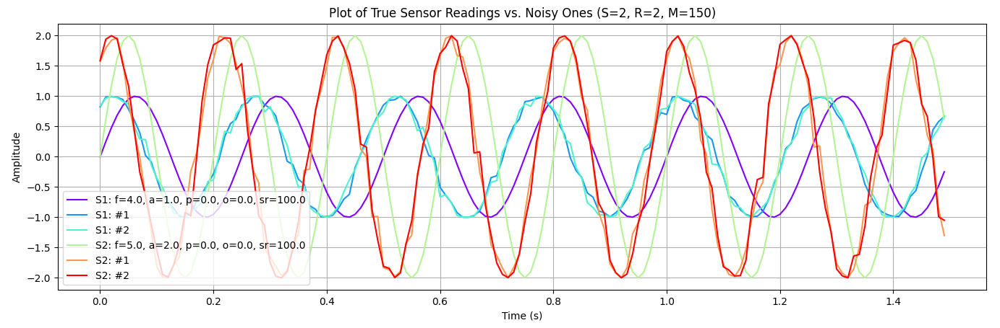

# Noisy Sensor Waveform Modelling 🌊
A python script for generating mock sensor waveform signal data with tunable noise.

<br>



<br>

# Install


1. Clone to your computer:
    ```
    git clone git@github.com:hwixley/Noisy-Sensor-Waveform-Modelling.git
    ```
2. Install the dependencies:
   ```
   pip3 install -r requirements.txt
   ```

3. Run the script:
   ```
   python3 runner.py
   ```